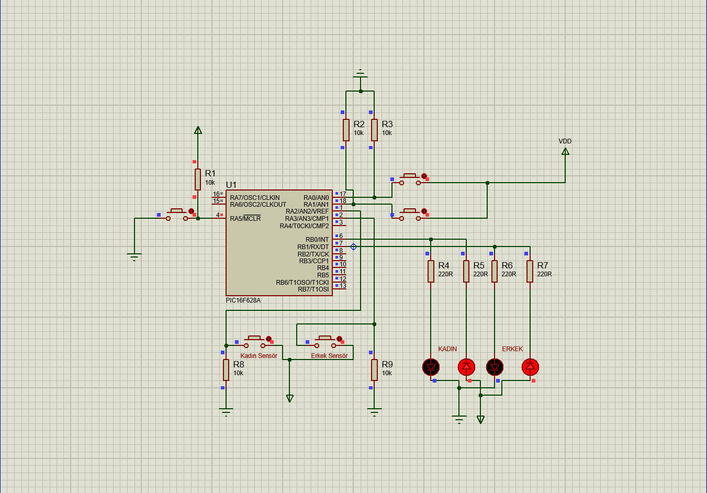

# Industrial-Automation-Production-Line-PIC16F628A
A passenger counter system for public buses using PIC16F628A and Assembly.
# 🏭 Industrial Production Line Capacity Controller / Endüstriyel Üretim Hattı Kapasite Kontrolörü

[Türkçe açıklamalar için aşağı kaydırın / Scroll down for Turkish]

## 🇺🇸 Project Overview
This project is an industrial automation simulation designed to manage production line output using the **PIC16F628A** microcontroller. It allows users to set a specific production target and monitors the process in real-time.

### 📋 Key Features
- **User-Defined Capacity:** Users can set the desired production limit (e.g., box count) using increment/decrement buttons before starting the line.
- **Process Monitoring:** Real-time counting of items passing through the sensor simulation.
- **Automated Stop:** The system automatically stops the production line and triggers an "ORDER COMPLETE" indicator when the target is reached.
- **Visual Interface:** Dual **7-segment displays** show both the set target and the current count via **multiplexing**.

### 🛠 Technical Details
- **Microcontroller:** PIC16F628A
- **Programming Language:** Assembly (MPASM)
- **Logic:** Implementation of user-input polling, interrupt-like button debouncing, and conditional logic for process termination.

---

## 🇹🇷 Proje Hakkında
Bu proje, **PIC16F628A** mikrodenetleyicisi kullanılarak, bir üretim hattındaki ürün sayısını yönetmek ve belirlenen hedefe ulaşıldığında sistemi durdurmak için tasarlanmış bir endüstriyel otomasyon simülasyonudur.

### 📋 Özellikler
- **Kullanıcı Tanımlı Kapasite:** Kullanıcı, hat çalışmaya başlamadan önce butonlar aracılığıyla hedef üretim miktarını (örneğin paket sayısı) belirleyebilir.
- **Süreç Takibi:** Sensör simülasyonu üzerinden geçen ürünlerin anlık olarak sayılması.
- **Otomatik Durdurma:** Belirlenen hedefe ulaşıldığında sistem hattı durdurur ve "ÜRETİM TAMAMLANDI" uyarısı verir.
- **Görsel Arayüz:** Hedeflenen ve anlık sayılan değerler, **multiplexing** tekniğiyle iki adet **7-segment display** üzerinde gösterilir.

### 🛠 Teknik Detaylar
- **Donanım:** PIC16F628A, 7-Segment Display, Kontrol Butonları.
- **Dil:** Assembly (MPASM).
- **Mantık:** Kullanıcı girişi tarama (polling), buton arkı önleme (debouncing) ve üretim sonlandırma için karşılaştırma mantığı.

---

## 📸 Circuit Diagram / Devre Şeması

## 🚀 Simulation / Simülasyon
1. Projeyi **Proteus ISIS** üzerinde açın. / Open the project in Proteus.
2. Hedef sayıyı belirlemek için ayar butonlarını kullanın. / Use set buttons to define the target.
3. Sensör butonuna basarak üretim sürecini başlatın. / Start production by clicking the sensor button.
